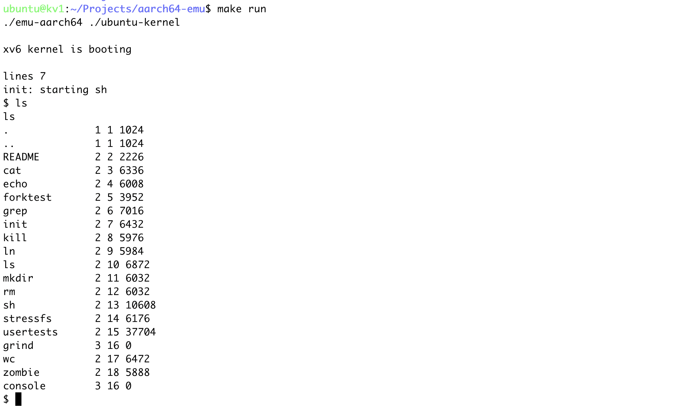

# AArch64 emulator

WIP AArch64 emulator that runs xv6[1].

This emulator supports:
- part of Armv8-A ISA
- Virtual memory, privileged level(EL0, EL1)
- peripherals (UART, Virtio, GICv3)
etc

[1][k-mrm/xv6-aarch64](https://github.com/k-mrm/xv6-aarch64)
